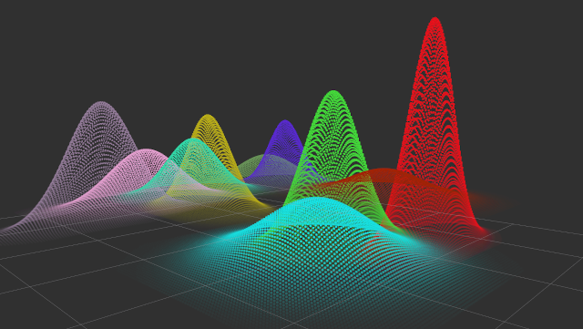

# Rviz Gaussian Distribution

<!--
# ==================================================================================================
#
#   Overview
#
# ==================================================================================================
--->

# Overview 

The `rviz_gaussian_distribution` package provides visualization of 2D Gaussian Distributions on Rviz.

**Content:**

* [Overview](#Overview)
* [Setup](#Setup)
* [Example](#Example)
* [Nodes](#Nodes)

<!--
# ==================================================================================================
#
#   Setup
#
# ==================================================================================================
--->

## Setup 
In `rviz_gaussian_distribution` pkgs.

    pip install -r requirements.txt

<!--
# ==================================================================================================
#
#   Example
#
# ==================================================================================================
--->

## Example 

Start example.

    roslaunch rviz_gaussian_distribution example.launch

Start the server.

    roslaunch rviz_gaussian_distribution server.launch

<!--
# ==================================================================================================
#
#   Nodes
#
# ==================================================================================================
--->

## Node 

<!--
# ==================================================================================================
#   Subscribed Topics
# ==================================================================================================
--->

### Subscribed Topics

* **`/input/add`** ([rviz_gaussian_distribution_msgs/GaussianDistribution])  
  Register 2d gaussian distribution with ID.

* **`/input/remove`** ([std_msgs/Int16])  
  Unregister registered distribution using ID.

* **`/input/clear`** ([std_msgs/Empty])  
  Unregister all registered distribution.

<!--
# ==================================================================================================
#   Published Topics
# ==================================================================================================
--->

### Published Topics

* **`/output`** ([sensor_msgs/PointCloud2])  
  Publish registered distributions.

<!--
# ==================================================================================================
#   Actions
# ==================================================================================================
--->

### Actions

* **`/Action/add`** ([rviz_gaussian_distribution_msgs/Add])  
  Register 2d gaussian distribution with ID.

* **`/Action/remove`** ([rviz_gaussian_distribution_msgs/Remove])  
  Unregister registered distribution using ID.

* **`/Action/clear`** ([rviz_gaussian_distribution_msgs/Clear])  
  Unregister all registered distribution.

<!--
# ==================================================================================================
#   Parameters
# ==================================================================================================
--->

### Parameters

* **`~is_animation`** (bool, default: true)  
  Enable or disable animation.

* **`~animation_time`** (bool, default: 1)  
  The animation times of each distribution.